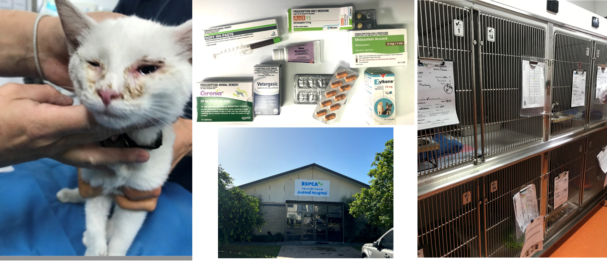
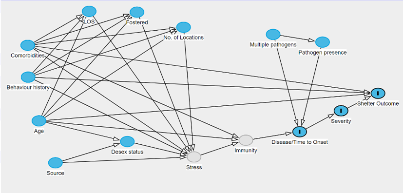
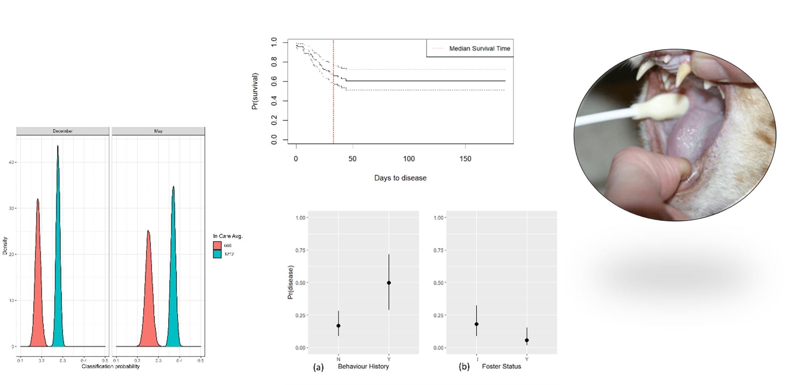

<link rel="stylesheet" href="styles.css" type="text/css">

Feline Upper Respiratory Tract Infection in animal shelters
 

## What is Cat Flu?

Feline upper respiratory tract infection (colloquially called ‘cat flu’) is a severe problem in cat populations around the world. It is especially of concern in animal shelters, where animals often face poor air circulation, high turnover of populations, concurrent comorbidities and previous malnourishment. Infections lead to increased morbidity, compromised welfare quality of life and increased euthanasia rates. 
Feline herpesvirus (FHV), feline calicivirus (FCV), Chlamydia felis (C.felis), Mycoplasma felis (M.felis) and Bordetella bronchiseptica (B.bronchiseptica) are commonly known to cause clinical disease. Clinical signs include serous, mucoid, or mucopurulent nasal discharge, sneezing, dyspnoea, conjunctivitis and ocular discharge, and ulcerations of the lips, tongue, gums, or nasal planum. Infected cats often become chronic carriers and can continue to shed the viruses for their lifetime. This chronicity of disease can cause permanent scarring of nasal passages, leading to chronic sinusitis, and recurrent bacterial infections of the upper respiratory tract.

 

## How can we better understand the epidemiology and risk factors associated with this disease?

 

We used natural language processing and machine learning to obtain case ascertainment from a large retrospective dataset of electronic veterinary records from RSPCA Queensland. With the help of a detailed causal framework, we used multiple models to quantify causal effects of admission variables (source, gender, age), number of animals in care, length of stay, time spent in foster and season on risk of cat flu. We conducted PCR tests on incoming animals to determine the prevalence of new infections, and explored what role this may have on the overall burden of clinical disease.

 

 

### Team members on the project

[Uttara Kennedy](people.html){target="_blank"},
[Nick Clark](people.html#nick){target="_blank"},
[Ricardo Soares Magalhães](people.html){target="_blank"}

 

### Key collaborators

Dr. Mandy Paterson (RSPCA Queensland), 
Dr. Doug Hayward & Dr.,
Susan Jaensch (Vetnostics, NSW).
  

 

## Publications

Kennedy, U., Paterson, M., & Clark, N. (2023).  [Using a gradient boosted model for case ascertainment from free-text veterinary records](https://doi.org/10.1016/j.prevetmed.2023.105850){target="_blank"}. *Preventive veterinary medicine*, 212, 105850
  
Kennedy, U., Paterson, M. and Clark, N. (2024) [Epidemiological insights into the burden of feline upper respiratory tract infections in Queensland RSPCA shelters](https://doi.org/10.1111/avj.13306){target="_blank"}. *Aust Vet J*, 102:87-95
  
