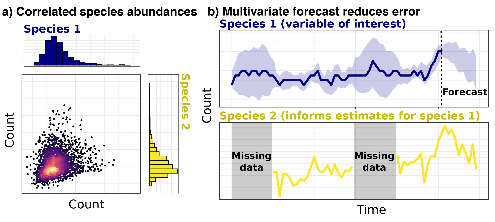

---
output:
  html_document: 
    toc: true
    toc_float: true
---

<link rel="stylesheet" href="styles.css" type="text/css">

Multivariate ecological modelling
 

## Why are multivariate ecological models necessary?

Usually, when modelling community responses (such as ecosystems, microbiomes or multiple infections in the same host individual), we build a series of univariate models that only focus on extraneous covariates (such as the effects of the environment, host demographics or landscape metrics). But this process is not accurate enough for generating predictions about how the entire community of response variables will change in different environments or under different treatment regimes. Newer [network based graphical models](https://medium.com/@jonathan_hui/machine-learning-graphical-model-b68b0c27a749){target="_blank"} – commonly used in social media analyses to document people's social interactions – offer an exciting way to address this gap in scientific knowledge. These innovative models give us a more accurate picture of reality by incorporating biology, allowing us to ask how one species responds to both environmental change and to the presence of other species. 

 

## Conditional Random Fields models

[Conditional Random Fields (CRF)](https://github.com/nicholasjclark/MRFcov){target="_blank"} models use species’ occurrences or abundances as outcome variables and allow variance to be partitioned among both abiotic and biotic effects. Some major advantages of these models are that they can:

1. Produce directly interpretable coefficients that allow users to determine the relative importances (i.e. effect sizes) of biotic associations and environmental covariates in driving abundances or occurrence probabilities  
  
2. Identify association strengths, rather than simply determining whether they are “significantly different from zero”  
  
3. Estimate how associations are predicted to change across environmental gradients.  
  
Some of our recent research has explored how CRFs can be applied to a variety of questions that involve investigating how multiple outcomes (such as co-infecting parasites or co-occurring fish species) associate with one another to form communities. This gives us unprecedented insights into how communities respond to environmental change and improves our ability to predict future variation. 

 

 

## Leveraging co-occurrence associations to predict biodiversity responses to climate change

Dr Clark recently led a multidisciplinary international research team that used this technique to analyse fish populations in the Mediterranean Sea, a fisheries-based [biodiversity hotspot](https://www.iucn.org/downloads/the_mediterranean_a_biodiversity_hotspot_under_threat_factsheet_en.pdf){target="_blank"} with its future under threat from rapidly warming seas. Experts from fisheries, ecology and the geographical sciences have compiled decades of research to describe the geographical ranges for more than 600 Mediterranean fish species. We put this information, along with data from the [Intergovernmental Panel on Climate Change’s sophisticated climate models](https://www.ipcc.ch/site/assets/uploads/2018/02/WG1AR5_Chapter09_FINAL.pdf){target="_blank"} into our graphical network model in a recent manuscript published in [Nature Climate Change](https://www.nature.com/articles/s41558-020-0838-5){target="_blank"}. We found that warming sea temperatures – particularly in winter – have widespread effects on fish biodiversity. Interestingly, effects of winter warming were on average 4X greater than summer effects, suggesting seasonality should not be ignored when assessing climate-related projections. 

 

 

A great deal of research and media attention has been on the impacts of extreme summer temperatures on people and nature, but winters are getting warmer too. Interestingly, coastal water temperatures are expected to increase at a faster rate in winter than in summer in the Mediterranean Sea. Even though winter warming might not reach the extreme high temperatures of summer heatwaves, this research shows that warmer winters could also lead to ecosystem disruption, in some cases more than hotter summer warming will. Our results suggest that winter warming will cause fish species to hang out together in different ways, and some species will disappear from some areas entirely.

 

 

This project utilised a number of recent advances in multivariate modelling and machine learning to generate predictions. It is our hope that this study will emphasise the need to understand community-level responses when trying to predict and address the impacts of climate change. If fish communities are more strongly regulated by winter temperatures as our model suggests, this means that fish diversity may change more quickly than we previously thought. Read more about this project in a [blogpost here](https://natureecoevocommunity.nature.com/posts/winter-warming-has-larger-and-more-widespread-effects-on-fish-communities){target="_blank"}. 

 

## *SpatialEpiLab*'s involvement

Our lab is involved in a number of collaborative projects that apply CRFs and other multivariate ecological models to tackle important multiresponse questions in ecology and disease ecology:  
1. How do associations among co-occurring species change across environmental gradients, and how do these associations influence community assembly?  
2. Can co-infection information be leveraged to generate more accurate and informative parasite infection risk models?  
3. Are multivariate text-based models able to identify latent infection exposure demographic groups using patient response questionnaires?

 

### Team members on the project

[Ricardo Soares Magalhães](people.html){target="_blank"}    
[Nicholas Clark](people.html#nicholas_clark){target="_blank"}

 

### Key collaborators

[Konstans Wells (Swansea University)](https://www.swansea.ac.uk/staff/science/biosciences/wells-k-l/){target="_blank"}  
[Ceridwen Fraser (Otago University)](https://www.otago.ac.nz/marinescience/people/staff/otago704457.html){target="_blank"}  
[Alison Peel (Griffith University)](https://experts.griffith.edu.au/7586-alison-peel){target="_blank"}  
[Nick Fountain-Jones (University of Tasmania)](https://scholar.google.com.au/citations?user=OV-PyoQAAAAJ&hl=en){target="_blank"}

  

 

## Publications

Clark, NJ, Tozer, S, Wood, C, Firestone, SM, Stevenson, M, Caraguel, C, Chaber, AL, Heller, J and Soares Magalhães, RJ. 2020. [Unravelling animal exposure profiles of human Q fever cases in Queensland, Australia using natural language processing](https://onlinelibrary.wiley.com/doi/abs/10.1111/tbed.13565). *Transboundary and Emerging Diseases*. DOI: https://doi.org/10.1111/tbed.13565.
  
Clark, NJ, Owada, K, Ruberanziza, E, Ortu, G, Umulisa, I, Bayisenge, U, Mbonigaba, JB, Mucaca, JB, Lancaster, W, Fenwick, A, Soares Magalhaes, RJ and  Mbituyumuremyi, A. 2020. [Parasite associations predict infection risk: incorporating co-infections in predictive models for neglected tropical diseases](https://parasitesandvectors.biomedcentral.com/articles/10.1186/s13071-020-04016-2). *Parasites & Vectors* 13:1-16.  
  
Clark, NJ, Kerry, JT and Fraser, CI. 2020. [Rapid winter warming could disrupt coastal marine fish community structure](https://www.nature.com/articles/s41558-020-0838-5). *Nature Climate Change*. DOI: 10.1038/s41558-41020-40838-41555.  
  
Fountain‐Jones, NM, Clark, NJ, Kinsley, AC, Carstensen, M, Forester, J, Johnson, TJ, Miller, E, Moore, S, Wolf, TM and Craft, ME. 2019. [Microbial associations and spatial proximity predict North American moose (Alces alces) gastrointestinal community composition](https://besjournals.onlinelibrary.wiley.com/doi/abs/10.1111/1365-2656.13154). *Journal of Animal Ecology* 89:817-828.  
  
Peel, AJ, Wells, K, Giles, J, Boyd, V, Burroughs, A, Edson, D, Crameri, G, Baker, ML, Field, H, Wang, LF, McCallum, H, Plowright, RK and Clark, NJ. 2019. [Synchronous shedding of multiple bat paramyxoviruses coincides with peak periods of Hendra virus spillover](https://www.tandfonline.com/doi/full/10.1080/22221751.2019.1661217). *Emerging Microbes & Infections* 8:1314-1323.

