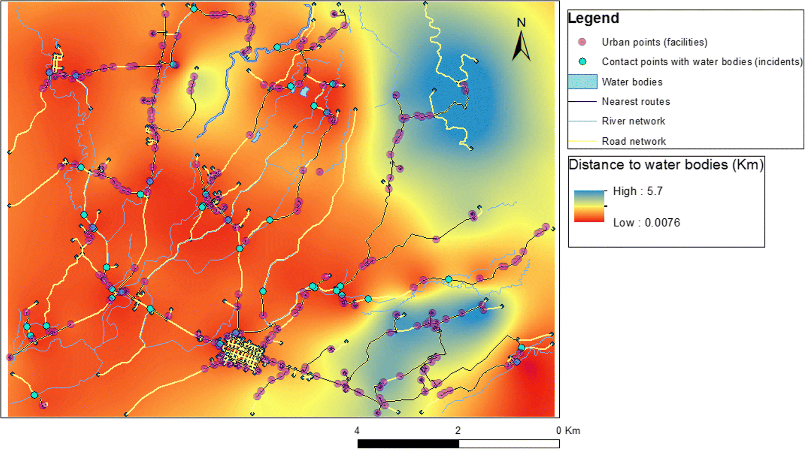
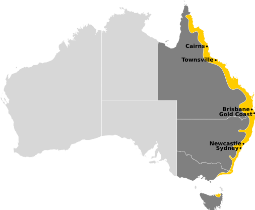

---
output:
  html_document: 
    toc: true
    toc_float: true
---

<link rel="stylesheet" href="styles.css" type="text/css">

Geographical and environmental patterns of disease
 

 

## Tick paralysis in Australian pets

[Tick paralysis](https://sashvets.com/tick-paralysis/){target="_blank"}, caused by neurotoxins contained in the saliva of *Ixodes* paralysis ticks, is a life-threatening condition for dogs and cats requiring immediate medical attention. In Australia tick paralysis is a leading cause of emergency admissions, with tens of thousands of cases admitted to veterinary emergency services each year. While preventative treatments and avoidance of tick-prone areas during periods of heightened risk are effective reduction measures, surveillance systems are inadequate to provide timely information to clinicians and pet owners located in areas most at-risk.

 

 

## *Ixodes* spp. in Australia

*Ixodes holocyclus* and *I. cornuatus* are endemic tick species responsible for the debilitating and often fatal condition in companion animals known as tick paralysis. Symptoms include loss of appetite, poor mobility and coordination, respiratory problems and death. Both of the causative tick species are distributed along Australia’s east coast and are associated with wet and humid habitats (see the figure below). Unfortunately, these distributions coincide with some of Australia’s most populous centres, meaning that many pets are at risk of tick paralysis each year.

 

 

Previous studies of tick paralysis risk in Australia have been hampered by poor case reporting, lack of high-resolution data and reliance on aggregated climate variables. Better surveillance systems are needed to help reduce the burden of tick-paralysis in Australian pets by capitalising on *big data* to anticipate areas that are likely to have cases in the future and to identify key environmental and/or social correlates. Such systems can also provide decision support tools to help local veterinary practices in high-risk zones by reminding them when to prioritise dissemination of preventative medicines and information packets to local pet owners.
 

 

 

## *SpatialEpiLab*'s involvement

Our lab is involved in a large collaborative project, driven by a [University of Queensland Early Career Researcher Grant](https://research.uq.edu.au/research-support/research-management/funding-schemes/uq-internal-initiatives/uq-early-career-researcher-grant-scheme) to [Dr Nicholas Clark](people.html#nicholas_clark){target="_blank"}, with overall objectives to:  
1. Develop a forecast model for tick paralysis risk using an automated, unsupervised learning pipeline to quantify spatiotemporal variation in tick paralysis cases.   
2. Host real-time paralysis tick risk maps on a secure online server to provide up-to-date information to relevant end users.

 

### Team members on the project

[Ricardo Soares Magalhães](people.html){target="_blank"}    
[Nicholas Clark](people.html#nicholas_clark){target="_blank"}

 

### Key collaborators

[GreenCross Veterinary Clinics](https://www.greencrossvets.com.au/){target="_blank"}  
[VetCompass Australia](http://www.vetcompass.com.au/){target="_blank"}  
[Henry Lydecker (University of Sydney)](https://sydney.edu.au/science/biology/hochuli/current.shtml){target="_blank"}  
[Paul McGreevy (University of Sydney)](https://sydney.edu.au/science/people/paul.mcgreevy.php){target="_blank"} 
  
