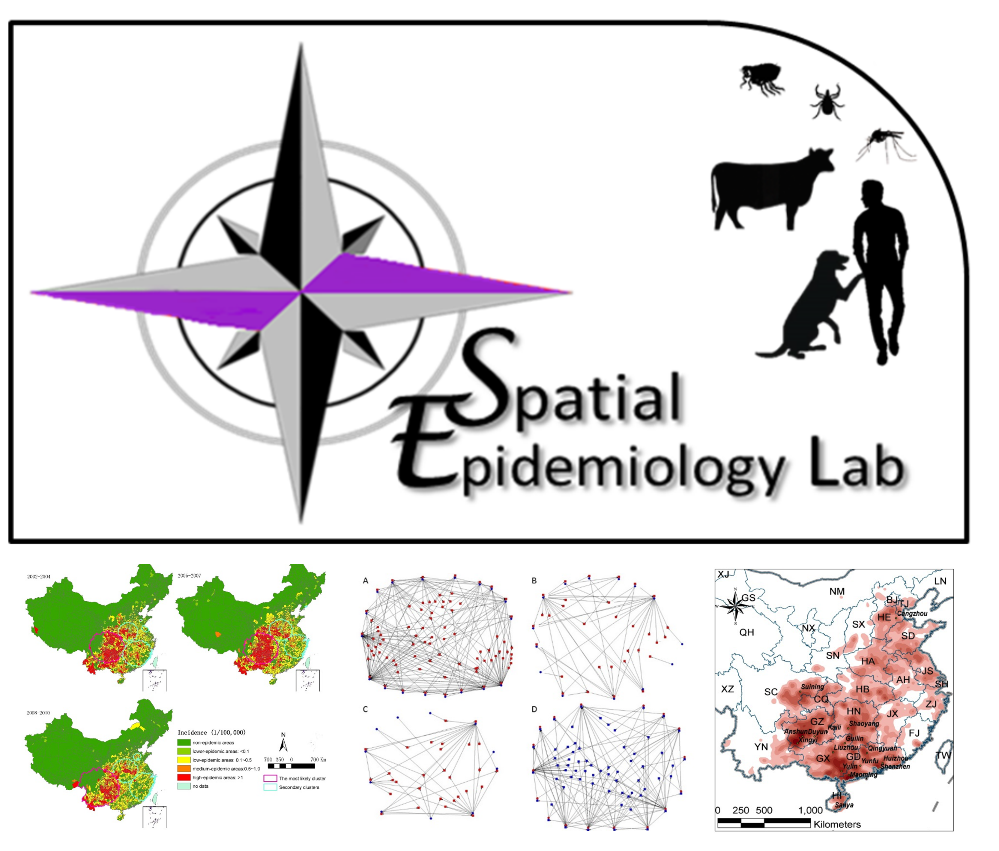

---
---

<link rel="stylesheet" href="styles.css" type="text/css">

The *SpatialEpiLab* is a [One Health](https://www.who.int/features/qa/one-health/en/) medical geography research group based at the University of Queensland, Australia, headed by Associate Professor Ricardo Soares Magalhães.

Research at the SpatialEpiLab lies at the interface between animal and human public health and aims to inform disease control policy through a better understanding of the major determinants in the geographical distribution of animal and human infections and associated morbidity.

Each year our research is published in high impact peer reviewed journals in the international literature. Most of the maps and tools derived from our research are available to other researchers and disease control programme managers. Please visit our research and publications pages to access more information about the work that we are currently involved in and the outputs we have produced. 

We welcome visitors to our lab, especially for our monthly lab chat.