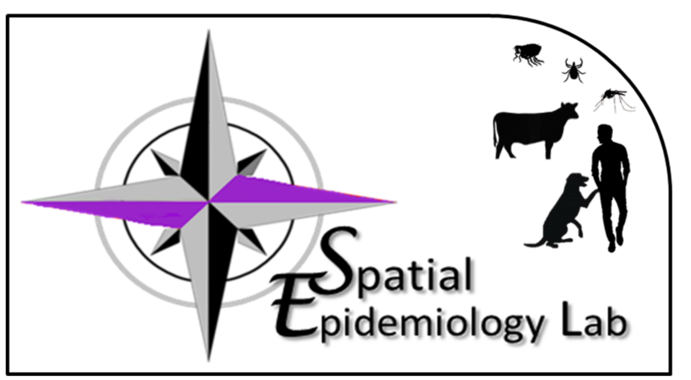

---
---

<link rel="stylesheet" href="styles.css" type="text/css">

**Who we are**
 
The *SpatialEpiLab* is a [One Health](https://www.who.int/features/qa/one-health/en/){target="_blank"} medical geography research group based at the [University of Queensland](https://veterinary-science.uq.edu.au/){target="_blank"}, Australia, headed by Associate Professor Ricardo Soares Magalhães. With a diversity of backgrounds and perspectives, we have broad expertise in health sciences, mathematical modelling, social sciences, ecology and epidemiology.
 
 
**What we do**
 
Research at the *SpatialEpiLab* lies at the interface between animal and human public health and aims to inform disease control policy by identifying major determinants of the geographical distributions of infections and their associated morbidities. We work with international partners to blend our multidisciplinary expertise and deliver in-depth investigations for many important pathogens.

Our work is routinely published in high impact peer reviewed journals in the international literature. Most of the maps and tools derived from our research are available to other researchers and disease control programme managers. 
 
 
**Browse around to find our more**
 
Please navigate these pages to access more information about the studies that we are currently involved in and the outputs we have produced. If you are interested or want to discuss potential projects, we readily welcome visitors to our lab, especially for our monthly lab chat.

