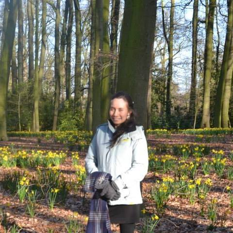

<link rel="stylesheet" href="styles.css" type="text/css">

Members of our team a wealth of expertise owing to their diverse backgrounds in veterinary science, ecology, spatial epidemiology and mathematical modelling. We apply spatial epidemiology and risk mapping approaches for projects at interface between animal and human public health to develop a broader understanding of what mechanisms influence the geographical distributions of animal and human infections.

## Ricardo Soares Magalhães {#ricardo}


<center>A/Prof Magalhães is an infectious disease epidemiologist with qualifications in both human and veterinary public health. His primary research focus is on the application of spatial risk assessment methods and population-based intervention studies to provide epidemiological evidence for more rational implementation of strategies for the control of infectious diseases of animals and humans. His interests are broad, ranging from the development of geographical models of infectious disease distribution to quantifying the role of spatial variation as an influence on socio-economic indicators such as water, sanitation and hygiene, to assessing the spatial distributions of helminth infection of children and associated morbidities. He has fostered collaborations that encompass many international and domestic partners, with a diversity of ongoing projects supported locally at UQ's [Child Health Research Centre](https://child-health-research.centre.uq.edu.au/){target="_blank"}, [School of Veterinary Science](https://veterinary-science.uq.edu.au/){target="_blank"} and [School of Public Health](https://public-health.uq.edu.au/){target="_blank"}. He is currently seeking PhD candidates with skills in data analysis, statistical programming and machine learning to contribute to projects linking Big Data to spatial and spatio-temporal epidemiology. Read more about A/Prof Magalhães's work on his [ResearchGate](https://www.researchgate.net/profile/Ricardo_Soares_Magalhaes){target="_blank"} and at his [Google Scholar](https://scholar.google.com.au/citations?user=aAh0t1AAAAAJ&hl=en){target="_blank"} page.</center>

<br>
<center>`A/Prof Soares Magalhães recent publications`</center>
```{r, echo = FALSE, warning=FALSE, message=FALSE}
library(kableExtra)
library(knitr)
source('./scholar_ids/scholar_ids.R')
source('functions/scholar_allpubs.R')
all_pubs <- scholar_allpubs(ricardo_id)
```

```{r, echo = FALSE, warning=FALSE, message=FALSE}
kable(data.frame(all_pubs %>%
          dplyr::filter(Year > 2016)), row.names = F,
      format = 'html') %>%
  kable_styling(bootstrap_options = c("striped", "hover", "condensed", "responsive")) %>%
  column_spec(2, width = '30em') %>%
  column_spec(3, italic = T, width = '20em') %>%
  column_spec(4, width = '20em') %>%
  scroll_box(width = "100%", height = "300px")
```
<br>

## Early Career Researchers
### Nicholas Clark


<center>Dr Clark is a Lecturer in Genetics and Molecular Epidemiology with broad interests in spatial epidemiology, molecular ecology and identifying mechanisms that influence the spread of disease at the human-wildlife interface. He graduated with a PhD from [Griffith University](https://www.griffith.edu.au/environmental-futures-research-institute){target="_blank"} under primary supervision of [Dr Sonya Clegg](https://www.zoo.ox.ac.uk/people/dr-sonya-clegg){target="_blank"}, where he used mathematical models to study factors that influence the ecology and evolution of [avian malaria](https://nicholasjclark.weebly.com/avian-parasites.html){target="_blank"} parasites. His role with the group is to conduct spatial modelling of zoonotic pathogens, primarily Q fever and rabies virus, as well as to lead efforts to forecast risks of tick infestation for Australian domestic animals. He is currently seeking PhD candidates with skills in data analysis and / or statistical programming to contribute to projects linking Big Data to molecular epidemiology. Read more about Dr Clark's work on his [UQ Researchers website](https://researchers.uq.edu.au/researcher/15140){target="_blank"} and at his [Google Scholar](https://scholar.google.com.au/citations?user=5bO9uxEAAAAJ&hl=en){target="_blank"} page.</center>

<br>
<center>`Dr Clark's recent publications`</center>
```{r, echo = FALSE, warning=FALSE, message=FALSE}
library(kableExtra)
library(knitr)
source('functions/scholar_allpubs.R')
all_pubs <- scholar_allpubs(nick_id)
```

```{r, echo = FALSE, warning=FALSE, message=FALSE}
kable(data.frame(all_pubs %>%
          dplyr::filter(Year > 2016)), row.names = F,
      format = 'html') %>%
  kable_styling(bootstrap_options = c("striped", "hover", "condensed", "responsive")) %>%
  column_spec(2, width = '30em') %>%
  column_spec(3, italic = T, width = '20em') %>%
  column_spec(4, width = '20em') %>%
  scroll_box(width = "100%", height = "300px")
```
<br>

### Javier Cortes Ramirez


<center>Dr Cortes-Ramirez is a medical doctor with clinical experience in diagnosis and treatment of tropical diseases including vector-borne diseases and zoonoses. He worked as a medical practitioner for 10 years in Colombia and Chile, as medical doctor with the International Committee of the Red Cross (2002) and as a consultant for [World Health Organization](https://www.who.int/){target="_blank"} for a national project on Environmental Health in the Solomon Islands (2015). As a researcher, he has experience studying the prevalence of ofidism (snake bite), Chagas disease in tropical countries as well as risk factors associated with silicosis in miners in Chile. In the last four years, he has developed spatial epidemiological studies on the association of coal mining with hospitalisations in Queensland. Dr Cortes-Ramirez is currently a lecturer in Environmental Health at UQ's [School of Public Health](https://public-health.uq.edu.au/){target="_blank"} Read more about his work at his [ResearchGate](https://www.researchgate.net/profile/Javier_Cortes-Ramirez) page.</center>

<br>

### Kei Owada


<centr>Dr Owada is a post-doctoral fellow at UQ, specialising in infectious disease epidemiology. She completed her PhD thesis on the role of soil-transmitted helminths on the cognitive development of school aged children at the UQ faculty of medicine (2019). Her primary supervisor was Associate Professor Ricardo J Soares Magalhães. She has received field epidemiology training at the US CDC (2011), and worked as a field epidemiologist. Her past work includes integrated disease surveillance work in Sierra Leone (2012), Ebola outbreak front line response work in Sierra Leone (2014-2015), and Ebola outbreak response and preparedness work at the WHO regional office in Brazzaville, Congo (2018-2019). Her experience also extends to the field of medical entomology, after receiving field entomology training in Samoa as part of the Samoa Lymphatic filariasis xenomonitoring project (2018).</center>

<br>

## PhD Students
### Pandji Dhewantara 


<center>Pandji is an early-career researcher working at the [National Institute of Health Research and Development (NIHRD)-Ministry of Health of Indonesia](https://www.litbang.kemkes.go.id/){target="_blank"}. He obtained his Master's degree on Environmental science in Padjajaran University, Bandung, Indonesia. In Indonesia, his research particularly focuses on the epidemiology of vector-borne diseases such as dengue, malaria and lymphatic filariasis. Currently, his PhD project is focusing on leptospirosis – a zoonotic bacterial disease caused by Leptospira in China. His project is aiming at estimating the burden of human leptospirosis in China and using spatial analytical tools to understand the spatial epidemiology of human leptospirosis in China and the effects of demographical, ecological and socio-economic factors on the geographical and temporal pattern of human leptospirosis. Pandji’s advisors are [A/Prof Ricardo Soares Magalhães](#ricardo), [A/Prof. Abdullah Mamun](https://researchers.uq.edu.au/researcher/1318){target="_blank"} from UQ's Institute of Social Science Research and [Prof. Wenbiao Hu](https://staff.qut.edu.au/staff/w2.hu){target="_blank"} from the School of Public Health and Social Work, Queensland University of Technology.  Read more about Pandji's work on his [ResearchGate](https://www.researchgate.net/profile/Pandji_Dhewantara){target="_blank"} and [Google Scholar](https://scholar.google.com/citations?user=awhMGaAAAAAJ&hl=id){target="_blank"} pages.</center>

<br>
<center>`Pandji's recent publications`</center>
```{r, echo = FALSE, warning=FALSE, message=FALSE}
library(kableExtra)
library(knitr)
source('functions/scholar_allpubs.R')
all_pubs <- scholar_allpubs(pandji_id)
```

```{r, echo = FALSE, warning=FALSE, message=FALSE}
kable(data.frame(all_pubs %>%
          dplyr::filter(Year > 2015)), row.names = F,
      format = 'html') %>%
  kable_styling(bootstrap_options = c("striped", "hover", "condensed", "responsive")) %>%
  column_spec(2, width = '30em') %>%
  column_spec(3, italic = T, width = '20em') %>%
  column_spec(4, width = '20em') %>%
  scroll_box(width = "100%", height = "300px")
```
<br>

### Tarni Cooper


<center>Tarni is a veterinarian interested in One Health, particularly the human aspects of agricultural research for development (R4D). Tarni’s current research is supporting efforts to improve veterinary antimicrobial stewardship in Vietnam using a systems approach, combining epidemiological and participatory tools. Tarni’s advisors are [A/Prof Ricardo Soares Magalhães](#ricardo), A/Prof Elske Van de Fliert from the [Centre for Communication and Social Change](http://www.uq.edu.au/ccsc/){target="_blank"} and Dr Delia Grace of the [International Livestock Research Institute](https://www.ilri.org/){target="_blank"}. Tarni’s research is supported by the [CGIAR Research Program on Agriculture for Nutrition and Health](http://a4nh.cgiar.org/){target="_blank"} and contributes to the [CGIAR Antimicrobial Resistance Hub](https://amr.cgiar.org/case-study/systems-approach-livelihood-sensitive-veterinary-antimicrobial-stewardship-thai-nguyen){target="_blank"}. Read more about Tarni's work on her [ResearchGate](https://www.researchgate.net/profile/Tarni_Cooper){target="_blank"} and [Google Scholar](https://scholar.google.com.au/citations?user=yZ2YwK8AAAAJ&hl=en){target="_blank"} pages.</center>

<br>
<center>`Tarni's recent publications`</center>
```{r, echo = FALSE, warning=FALSE, message=FALSE}
library(kableExtra)
library(knitr)
source('functions/scholar_allpubs.R')
all_pubs <- scholar_allpubs(tarni_id)
```

```{r, echo = FALSE, warning=FALSE, message=FALSE}
kable(data.frame(all_pubs %>%
          dplyr::filter(Year > 2015)), row.names = F,
      format = 'html') %>%
  kable_styling(bootstrap_options = c("striped", "hover", "condensed", "responsive")) %>%
  column_spec(2, width = '30em') %>%
  column_spec(3, italic = T, width = '20em') %>%
  column_spec(4, width = '20em') %>%
  scroll_box(width = "100%", height = "300px")
```
<br>

### Hester Rynhoud


<center>Hester is a PhD student interested in the study of zoonotic bacterial diseases and how they contribute to the One Health concept. Hester’s current research focuses on the molecular and spatial epidemiology of methicillin resistant *Staphylococcus* spp. carriage in Brisbane's domestic and shelter animals. Hester’s advisors at UQ are [A/Prof Ricardo Soares Magalhães](#ricardo), [Dr Justine Gibson](https://researchers.uq.edu.au/researcher/1359){target="_blank"} and [Dr Erika Meler](https://researchers.uq.edu.au/researcher/11041){target="_blank"}. Read more about Hester’s work on her [ResearchGate](https://www.researchgate.net/profile/Hester_Rynhoud){target="_blank"} page.</center>

<br>

### Yalemzewod Assefa Gelaw (Yalem)


<center>Yalemzewod is a PhD candidate interested in infectious disease, particularly in Human Immunodeficiency Virus (HIV) and tuberculosis (TB). Yalem’s current research focuses on the epidemiology of tuberculosis and HIV associated TB co-infection in Ethiopia. Yalem joined the University of Queensland after ten years of experience working in the Ministry of Health as a senior environmental health officer, as well as holding an academic position at the [University of Gondar](http://www.uog.edu.et/en/) in Ethiopia. He obtained his master’s degree on Master of public health in Epidemiology and Biostatistics in University of Gondar, Ethiopia. Yalem’s advisors are [Prof Gail Williams](https://researchers.uq.edu.au/researcher/668), [Dr Yibeltal Alemu](https://researchers.uq.edu.au/researcher/15240) and [A/Prof Ricardo Soares Magalhães](#ricardo). Read more about Yalem’s work on his [Google scholar](https://scholar.google.com.au/citations?user=yVWRy2wAAAAJ&hl=en){target="_blank"} and [ResearchGate](https://www.researchgate.net/profile/Yalemzewod_Gelaw){target="_blank"} pages. </center>

<br>
<center>`Yalem's recent publications`</center>
```{r, echo = FALSE, warning=FALSE, message=FALSE}
library(kableExtra)
library(knitr)
source('functions/scholar_allpubs.R')
all_pubs <- scholar_allpubs(yalem_id)
```

```{r, echo = FALSE, warning=FALSE, message=FALSE}
kable(data.frame(all_pubs %>%
          dplyr::filter(Year > 2016)), row.names = F,
      format = 'html') %>%
  kable_styling(bootstrap_options = c("striped", "hover", "condensed", "responsive")) %>%
  column_spec(2, width = '30em') %>%
  column_spec(3, italic = T, width = '20em') %>%
  column_spec(4, width = '20em') %>%
  scroll_box(width = "100%", height = "300px")
```
<br>

### Andrea Araujo Navas


<center>Andrea is a geographer currently conducting PhD research into uncertainties related to spatial epidemiological studies. Her interest are to analyse spatial structures from epidemiological data as well as to focus on the relevance of different environmental risk factors that determine the exposure to *Schistosoma japonicum* infection in the Philippines. Andrea’s main research is at the [Faculty of Geo-information and Earth Observations Sciences](https://www.itc.nl/){target="_blank"} at the University of Twente in the Netherlands. Her advisors are [Prof Alfred Stein](https://research.utwente.nl/en/persons/alfred-stein){target="_blank"} and [Dr Frank Osei](https://research.utwente.nl/en/persons/frank-osei){target="_blank"} at UTwente, and [A/Prof Ricardo Soares Magalhães](#ricardo) at University of Queensland. Read more about Andrea’s work on her [ResearchGate](https://www.researchgate.net/profile/Andrea_Araujo){target="_blank"} page. </center>

<br>

### Tuhin Biswas


<center>Tuhin started his research career as a research fellow in one of the centre of excellence "Centre for Control of Chronic Diseases" at icddr,b which was established with funding support from [National Heart Lung and Blood Institute (NHLBI)](https://www.nhlbi.nih.gov/){target="_blank"}. He has experience working in a number of research projects that include diabetes & prediabetes, surveillance and community management of hypertension, metabolic syndrome, child obesity, mental health and its resultant health effects in Bangladesh. His major works included implementation of research projects; planning, organizing and carry out various research/field research and study activities. His PhD research will explore the double burden of malnutrition among the women in South and Southeast Asia and its geographical variation, health inequality and health achievement. Tuhin’s advisors are [A/Prof Abdullah Mamun](https://researchers.uq.edu.au/researcher/1318){target="_blank"} and [A/Prof Ricardo Soares Magalhães](#ricardo). Read more about Tuhin’s work on his [Google scholar](https://scholar.google.com.au/citations?user=8Jpp1CAAAAAJ&hl=en&oi=sra){target="_blank"} and [ResearchGate](https://www.researchgate.net/profile/Tuhin_Biswas2){target="_blank"} pages.</center>

<br>
<center>`Tuhin's recent publications`</center>
```{r, echo = FALSE, warning=FALSE, message=FALSE}
library(kableExtra)
library(knitr)
source('functions/scholar_allpubs.R')
all_pubs <- scholar_allpubs(tuhin_id)
```

```{r, echo = FALSE, warning=FALSE, message=FALSE}
kable(data.frame(all_pubs %>%
          dplyr::filter(Year > 2016)), row.names = F,
      format = 'html') %>%
  kable_styling(bootstrap_options = c("striped", "hover", "condensed", "responsive")) %>%
  column_spec(2, width = '30em') %>%
  column_spec(3, italic = T, width = '20em') %>%
  column_spec(4, width = '20em') %>%
  scroll_box(width = "100%", height = "300px")
```
<br>

### Md. Mehedi Hasan


<center>Md. Mehedi Hasan is a PhD student at The University of Queensland. He has been awarded an International Research Training Program (RTP) scholarship funded by the Commonwealth Government of Australia to undertake his current doctoral research. His doctoral thesis is focused on maternal and child health in low- and middle- income countries. Prior to his PhD studies, Mehedi served icddr,b; an International research organization based in Bangladesh and Helen Keller International (HKI) in Bangladesh. During his professional period, he was involved in several projects focusing on nutritional status of women and under five children, household food insecurity, food consumption, dietary diversity, infant and young child feeding practices, maternal and reproductive health, homestead food production, and hygiene.</center>
<br>

### Shovon Chakma 


<center>Shovon Chakma is a veterinarian from Bangladesh with an over four years of experience
working in infectious disease surveillance programs in Bangladesh. He completed One Health Epidemiology Fellowship from Massey University, New Zealand in 2016 and is a life member of One Health Bangladesh. Prior to joining the *SpatialEpiLab* at the School of Veterinary Science at the UQ, he worked as a National Technical Advisor (Epidemiology) for Emergency Centre for Transboundary Animal Diseases (ECTAD) of the [UN Food and Agriculture Organization in Bangladesh](http://www.fao.org/bangladesh/en/){target="_blank"}, focusing particularly on avian influenza virus (AIV) and antimicrobial resistance (AMR) surveillance systems in live bird markets and livestock disease outbreak investigation. As a researcher, he implemented the first known study of zoonotic agents carried by non-indigenous rodents living in the Australian wet-tropical forest interface. His PhD project will evaluate the risk of live bird market environmental contamination heterogeneity with avian influenza over space and time in Bangladesh, which will then be linked to health outcomes in poultry and humans. Outside of work and study, he enjoys playing cricket and site-seeing.</center>

<br>
<center>`Shovon's recent publications`</center>
```{r, echo = FALSE, warning=FALSE, message=FALSE}
library(kableExtra)
library(knitr)
source('functions/scholar_allpubs.R')
all_pubs <- scholar_allpubs(shovon_id)
```

```{r, echo = FALSE, warning=FALSE, message=FALSE}
kable(data.frame(all_pubs), row.names = F,
      format = 'html') %>%
  kable_styling(bootstrap_options = c("striped", "hover", "condensed", "responsive")) %>%
  column_spec(2, width = '30em') %>%
  column_spec(3, italic = T, width = '20em') %>%
  column_spec(4, width = '20em') %>%
  scroll_box(width = "100%", height = "300px")
```

<br> 

### Philip Mshelbwala


<center>Philip is a veterinarian and lecturer at the [University of Abuja, Nigeria](https://web.uniabuja.edu.ng/){target="_blank"}. He has worked with the [African Epidemiology Network (AFENET)](http://www.afenet.net/){target="_blank"}, through which he has contributed to the control of the spread of polio and other vaccine-preventable diseases of children in high risk areas in Northeastern Nigeria. He has coordinated and participated in several rabies control programs in Nigeria and other African countries. He serves as the welfare officer of the Rabies In West Africa (RIWA), Nigeria and contributes to the War Against Rabies Foundation (WAR). He earned a diploma of rabies surveillance and control from the University of Lausanne, Switzerland. He has participated in The United States Center for Disease Prevention and Control (US,CDC) Biosecurity Engagement Program in southwestern Nigeria. The result from the study demonstrated a novel strain of *Bartonella*, proposed as *B. rousetti*, in fruit bats which might be capable of infecting humans. Philip’s research interest focus on infectious and zoonotic disease, particularly of companion animals. During his PhD, he will be using spatial and analytical tools to understand the pattern of rabies transmission in Nigeria and China with the view of formulating a robust framework for effective surveillance and control at the human and animal interface. Philip’s advisors are [A/Prof Ricardo Soares Magalhães](#ricardo), [A/Prof Abdullah Mamun](https://researchers.uq.edu.au/researcher/1318){target="_blank"} and [Prof J. Scott Weese](https://ovc.uoguelph.ca/pathobiology/people/faculty/Scott-Weese){target="_blank"}. Read more about Philip’s work on his [ResearchGate](https://www.researchgate.net/profile/P_Mshelbwala){target="_blank"} page.</center>

<br>
<center>`Philip's recent publications`</center>
```{r, echo = FALSE, warning=FALSE, message=FALSE}
library(kableExtra)
library(knitr)
source('functions/scholar_allpubs.R')
all_pubs <- scholar_allpubs(philip_id)
```

```{r, echo = FALSE, warning=FALSE, message=FALSE}
kable(data.frame(all_pubs), row.names = F,
      format = 'html') %>%
  kable_styling(bootstrap_options = c("striped", "hover", "condensed", "responsive")) %>%
  column_spec(2, width = '30em') %>%
  column_spec(3, italic = T, width = '20em') %>%
  column_spec(4, width = '20em') %>%
  scroll_box(width = "100%", height = "300px")
```

<br>

### Xiaoyan Zhou


<center>Xiaoyan is currently a PhD student studying the spatial epidemiology of emerging infectious diseases. Xiaoyan’s research topic is Spatial Risk Assessment of the Zoonotic Influenza A (H7N9) along the Live Meat Chicken Market Chain in Southeast China. Her research aims to get a better understanding of live poultry market chains in eastern China, with the specific aim to define the risks of sustained transmission of H7N9 virus along the live meat chicken market chain in eastern China. Before she started her PhD, she has been working as national GIS specialist for the [Food and Agriculture Organization of the United Nations in China](http://www.fao.org/china/en/){target="_blank"} for over four years. Here she mainly focused on applying statistical modeling and simulation approaches to conduct risk assessment and spatial prediction to better understand the epidemiological features of zoonotic  diseases in Asian countries. Xiaoyan obtained her master’s degree in Geospatial Sciences and Remote Sensing from the [Chinese Academy of Sciences](http://english.cas.cn/){target="_blank"}.  
   
Xiaoyan’s PhD advisors are [A/Prof Ricardo Soares Magalhães](#ricardo), [Dr Carl Smith](https://researchers.uq.edu.au/researcher/732){target="_blank"} from UQ, [Prof Archie C.A. Clements](https://research.curtin.edu.au/supervisor/prof-archie-clements/){target="_blank"} from Curtin University and [Prof John Edwards](http://www.murdoch.edu.au/Murdoch-Commission/Commissions/Second-Murdoch-Commission/Commission-Members/Professor-John-Edwards/){target="_blank"} from Murdoch University. Xiaoyan is funded through a University of Queensland International Postgraduate Research Scholarship (UQ IPRS). Xiaoyan’s field survey was funded by the [Emergency Center for Transboundary Animal Diseases (ECTAD)](http://www.fao.org/emergencies/fao-in-action/ectad/en/){target="_blank"} in China, FAO of the United Nations and the [China Animal Health and Epidemiology Center (CAHEC)](http://safeedpap.feedsafety.org/partners/cahec-china-animal-health-and-epidemiology-cente/){target="_blank"}. Read more about Xiaoyan’s work on her [ResearchGate](https://www.researchgate.net/profile/Xiaoyan_Zhou6){target="_blank"} page.</center>

<br> 

## Undergraduate Researchers
### Alex Pekin 


<center>Alex is currently an Honours scholar at the University of Queensland. He graduated with a Bachelor of Science (Animal and Veterinary Bioscience) in 2018 and is researching risk factors and spatial distribution of dog bite attacks in South-East Queensland; a collaborative project between the University of Queensland and Queensland Health. He is committed to utilizing a One Health approach as a method of improving healthcare infrastructure in developed and developing countries. As an undergraduate he contributed to work quantifying the temporal relationship between H7N9 avian influenza onset in humans with poultry surveillance, live bird movements, and sociodemographic factors. He plans to pursue further study into One Health issues, with a focus on veterinary solutions and interventions. Alex’s advisor is [A/Prof Ricardo Soares Magalhães](#ricardo).</center>


