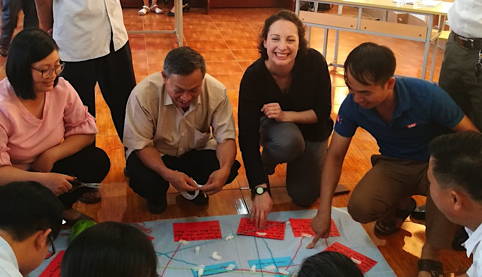
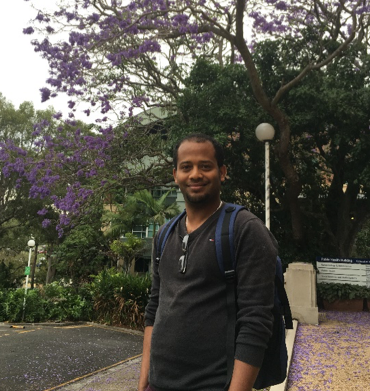

---
output:
  html_document: 
    toc: true
    toc_float: true
---

<link rel="stylesheet" href="styles.css" type="text/css">

Members of our team a wealth of expertise owing to their diverse backgrounds in veterinary science, ecology, spatial epidemiology and mathematical modellings. We apply spatial epidemiology and risk mapping approaches for projects at interface between animal and human public health to develop a broader understanding of what mechanisms influence the geographical distributions of animal and human infections.

## Ricardo Soares Magalhães {#ricardo}
Position: Lab Head

<br>
<center>`A/Prof Soares Magalhães recent publications`</center>
```{r, echo = FALSE, warning=FALSE, message=FALSE}
library(kableExtra)
library(knitr)
source('./scholar_ids/scholar_ids.R')
source('functions/scholar_allpubs.R')
all_pubs <- scholar_allpubs(ricardo_id)
```

```{r, echo = FALSE, warning=FALSE, message=FALSE}
kable(data.frame(all_pubs %>%
          dplyr::filter(Year > 2016)), row.names = F,
      format = 'html') %>%
  kable_styling(bootstrap_options = c("striped", "hover", "condensed", "responsive")) %>%
  column_spec(2, width = '30em') %>%
  column_spec(3, italic = T, width = '20em') %>%
  column_spec(4, width = '20em') %>%
  scroll_box(width = "100%", height = "300px")
```
<br>

## Postdoctoral Fellows
### Nicholas Clark


<center>Dr Clark is a Postdoctoral Fellow with broad interests in spatial epidemiology, molecular ecology and identifying mechanisms that influence the spread of disease at the human-wildlife interface. He graduated with a PhD from [Griffith University](https://www.griffith.edu.au/environmental-futures-research-institute){target="_blank"} under primary supervision of [Dr Sonya Clegg](https://www.zoo.ox.ac.uk/people/dr-sonya-clegg){target="_blank"}, where he used mathematical models to study avian malaria parasites. His role with the group is to conduct spatial modelling of zoonotic pathogens, primarily Q fever and rabies, as well as to lead efforts to forecast risks of tick infestation for Australian domestic animals. Read more about Dr Clark's work on his [personal website](https://nicholasjclark.weebly.com/){target="_blank"} and at his [Google Scholar](https://scholar.google.com.au/citations?user=5bO9uxEAAAAJ&hl=en){target="_blank"} page.</center>

<br>
<center>`Dr Clark's recent publications`</center>
```{r, echo = FALSE, warning=FALSE, message=FALSE}
library(kableExtra)
library(knitr)
source('functions/scholar_allpubs.R')
all_pubs <- scholar_allpubs(nick_id)
```

```{r, echo = FALSE, warning=FALSE, message=FALSE}
kable(data.frame(all_pubs %>%
          dplyr::filter(Year > 2016)), row.names = F,
      format = 'html') %>%
  kable_styling(bootstrap_options = c("striped", "hover", "condensed", "responsive")) %>%
  column_spec(2, width = '30em') %>%
  column_spec(3, italic = T, width = '20em') %>%
  column_spec(4, width = '20em') %>%
  scroll_box(width = "100%", height = "300px")
```
<br>

### Javier Cortes Ramirez
Position:  Postdoctoral Fellow

<br>


## PhD Students
### Pandji Dhewantara 


<center>Pandji is an early-career researcher working at the [National Institute of Health Research and Development (NIHRD)-Ministry of Health of Indonesia](https://www.litbang.kemkes.go.id/){target="_blank"}. He obtained his Master's degree on Environmental science in Padjajaran University, Bandung, Indonesia. In Indonesia, his research particularly focuses on the epidemiology of vector-borne diseases such as dengue, malaria and lymphatic filariasis. Currently, his PhD project is focusing on leptospirosis – a zoonotic bacterial disease caused by Leptospira in China. His project is aiming at estimating the burden of human leptospirosis in China and using spatial analytical tools to understand the spatial epidemiology of human leptospirosis in China and the effects of demographical, ecological and socio-economic factors on the geographical and temporal pattern of human leptospirosis. Pandji’s advisors are [A/Prof Ricardo Soares Magalhães](#ricardo), [A/Prof. Abdullah Mamun](https://researchers.uq.edu.au/researcher/1318){target="_blank"} from UQ's Institute of Social Science Research and [Prof. Wenbiao Hu](https://staff.qut.edu.au/staff/w2.hu){target="_blank"} from the School of Public Health and Social Work, Queensland University of Technology.  Read more about Pandji's work on his [ResearchGate](https://www.researchgate.net/profile/Pandji_Dhewantara){target="_blank"} and [Google Scholar](https://scholar.google.com/citations?user=awhMGaAAAAAJ&hl=id){target="_blank"} pages.</center>

<br>
<center>`Pandji's recent publications`</center>
```{r, echo = FALSE, warning=FALSE, message=FALSE}
library(kableExtra)
library(knitr)
source('functions/scholar_allpubs.R')
all_pubs <- scholar_allpubs(pandji_id)
```

```{r, echo = FALSE, warning=FALSE, message=FALSE}
kable(data.frame(all_pubs %>%
          dplyr::filter(Year > 2015)), row.names = F,
      format = 'html') %>%
  kable_styling(bootstrap_options = c("striped", "hover", "condensed", "responsive")) %>%
  column_spec(2, width = '30em') %>%
  column_spec(3, italic = T, width = '20em') %>%
  column_spec(4, width = '20em') %>%
  scroll_box(width = "100%", height = "300px")
```
<br>

### Tarni Cooper


<center>Tarni is a veterinarian interested in One Health, particularly the human aspects of agricultural research for development (R4D). Tarni’s current research is supporting efforts to improve veterinary antimicrobial stewardship in Vietnam using a systems approach, combining epidemiological and participatory tools. Tarni’s advisors are [A/Prof Ricardo Soares Magalhães](#ricardo), A/Prof Elske Van de Fliert from the [Centre for Communication and Social Change](http://www.uq.edu.au/ccsc/){target="_blank"} and Dr Delia Grace of the [International Livestock Research Institute](https://www.ilri.org/){target="_blank"}. Read more about Tarni's work on her [ResearchGate](https://www.researchgate.net/profile/Tarni_Cooper){target="_blank"} and [Google Scholar](https://scholar.google.com.au/citations?user=yZ2YwK8AAAAJ&hl=en){target="_blank"} pages.</center>

<br>
<center>`Tarni's recent publications`</center>
```{r, echo = FALSE, warning=FALSE, message=FALSE}
library(kableExtra)
library(knitr)
source('functions/scholar_allpubs.R')
all_pubs <- scholar_allpubs(tarni_id)
```

```{r, echo = FALSE, warning=FALSE, message=FALSE}
kable(data.frame(all_pubs %>%
          dplyr::filter(Year > 2015)), row.names = F,
      format = 'html') %>%
  kable_styling(bootstrap_options = c("striped", "hover", "condensed", "responsive")) %>%
  column_spec(2, width = '30em') %>%
  column_spec(3, italic = T, width = '20em') %>%
  column_spec(4, width = '20em') %>%
  scroll_box(width = "100%", height = "300px")
```
<br>

### Hester Rynhoud


<center>Hester is a PhD student interested in the study of zoonotic bacterial diseases and how they contribute to the One Health concept. Hester’s current research focuses on the molecular and spatial epidemiology of methicillin resistant *Staphylococcus* spp. carriage in Brisbane's domestic and shelter animals. Hester’s advisors at UQ are [A/Prof Ricardo Soares Magalhães](#ricardo), [Dr Justine Gibson](https://researchers.uq.edu.au/researcher/1359) and [Dr Erika Meler](https://researchers.uq.edu.au/researcher/11041). Read more about Hester’s work on her [ResearchGate](https://www.researchgate.net/profile/Hester_Rynhoud) page.</center>

<br>

### Yalemzewod Assefa Gelaw (Yalem)


<center>Yalemzewod is a PhD candidate interested in infectious disease, particularly in Human Immunodeficiency Virus (HIV) and tuberculosis (TB). Yalme’s current research focuses on the epidemiology of tuberculosis and HIV associated TB co-infection in Ethiopia.  Yalem joined the University of Queensland after ten years of experience working in the Ministry of Health as a senior environmental health officer, as well as holding an academic position at the [University of Gondar](http://www.uog.edu.et/en/) in Ethiopia. He obtained his master’s degree on Master of public health in Epidemiology and Biostatistics in University of Gondar, Ethiopia. Yalem’s advisors are [Prof Gail Williams](https://researchers.uq.edu.au/researcher/668), [Dr Yibeltal Alemu](https://researchers.uq.edu.au/researcher/15240) and [A/Prof Ricardo Soares Magalhães](#ricardo). Read more about Yalem’s work on [Google scholar](https://scholar.google.com.au/citations?user=yVWRy2wAAAAJ&hl=en) and [ResearchGate](https://www.researchgate.net/profile/Yalemzewod_Gelaw) pages. </center>

<br>
<center>`Yalem's recent publications`</center>
```{r, echo = FALSE, warning=FALSE, message=FALSE}
library(kableExtra)
library(knitr)
source('functions/scholar_allpubs.R')
all_pubs <- scholar_allpubs(yalem_id)
```

```{r, echo = FALSE, warning=FALSE, message=FALSE}
kable(data.frame(all_pubs %>%
          dplyr::filter(Year > 2016)), row.names = F,
      format = 'html') %>%
  kable_styling(bootstrap_options = c("striped", "hover", "condensed", "responsive")) %>%
  column_spec(2, width = '30em') %>%
  column_spec(3, italic = T, width = '20em') %>%
  column_spec(4, width = '20em') %>%
  scroll_box(width = "100%", height = "300px")
```
<br>

### Tuhin Biswas
Position: PhD Student

<br>

### Md. Mehedi Hasan
Position: PhD Student

<br>

### Xiaoyan Zhou
Position: PhD Student

<br>

### Kei Owada
Position: PhD Student

<br>

### Andrea Araujonavas
Position: PhD Student

<br>

### Angela M. Cadavid
Position: PhD Student

<br>

<center><h2>Undergraduate Researchers</h2></center>
### Alex Pekin 
Position: Undergraduate Researcher

<br>

### Carlos Donoghue
Position: Undergraduate Researcher

<br>

### Grace Henry
Position: Undergraduate Researcher

<br>

## Alumni
### Mohamad Assoum 
Position: Alumnus


