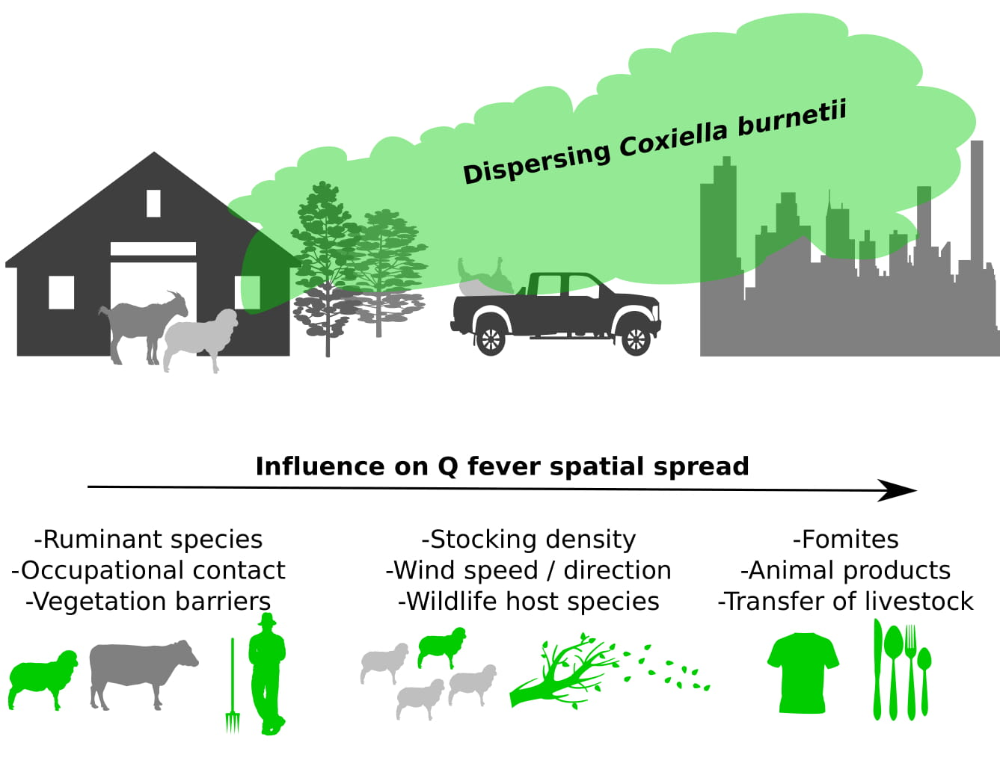

---
output:
  html_document: 
    toc: true
    toc_float: true
---

<link rel="stylesheet" href="styles.css" type="text/css">

Q fever: a zoonotic pathogen of high biosecurity risk
 

## What is Q fever?

Q fever is an illness of both humans and animals caused by the bacterium *Coxiella burnetii*. This is an environmentally resistant and extremely infectious organism which is typically transmitted to people by either direct or indirect contact with infected animals, animal products or contaminated materials. Sheep, goats and cattle are the main sources of infection for people, however other animals including dogs, cats and macropods may also be implicated. 

 

## *Coxiella burnetii* in Australia

Of particular interest to Australian farmers and livestock workers, intensively managed sheep and dairy goat herds provide conditions favourable for amplification and spread of Q fever. In addition, inland Australia's hot and dry conditions help the bacterium to spread and cause environmental contamination, particularly since the most common routes of infection are thought to be inhalation of contaminated dust and close contact with infected animals (particularly their birthing products).

 

## *SpatialEpiLab*'s involvement

Our lab is involved in a large collaborative project with overall objectives to:  
1. Develop a better understanding of factors influencing the risk of Q fever spread within and between Australian ruminant livestock enterprises  
2. Develop national guidelines for an emergency response plan to be used in the event of future Q fever outbreaks in humans.
Read more about the project's developments by following the Qfever_Group on [Twitter](https://twitter.com/Qfever_Group){target="_blank"}.

 

### Team members on the project

Ricardo Soares Magalhães  
Nicholas Clark

 

### Key collaborators

[Mark Stevenson (University of Melbourne)](https://www.findanexpert.unimelb.edu.au/display/person653385){target="_blank"}  
[Simon Firestone (University of Melbourne)](https://www.findanexpert.unimelb.edu.au/display/person449832){target="_blank"}  
[Anke Wiethoelter (University of Melbourne)](https://www.findanexpert.unimelb.edu.au/display/person772746){target="_blank"}  
[Charles Caraguel (University of Adelaide)](https://www.adelaide.edu.au/directory/charles.caraguel){target="_blank"}   
[Jane Heller (Charles Sturt University)](https://science.csu.edu.au/schools/animal-vet/staff/profiles/associate-professors/jane-heller){target="_blank"}   
[Australian Rickettsial Reference Laboratory](https://www.rickettsialab.org.au/){target="_blank"}
  

 

## Publications

Clark, NJ and Soares Magalhães, RJ. 2018. [Airborne geographical dispersal of Q fever from livestock holdings to human communities: a systematic review and critical appraisal of evidence](https://bmcinfectdis.biomedcentral.com/articles/10.1186/s12879-018-3135-4){target="_blank"}. *BMC Infectious Diseases*. 18:218.

